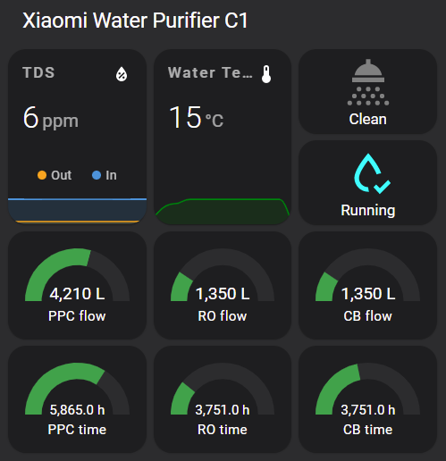

# xiaomi_miio_waterpurifier_yunmi

Home Assistant custom component for Xiaomi Water Purifier C1, based on `python-miio` package

## Currently supported model

* [yunmi.waterpuri.lx9](https://home.miot-spec.com/spec/yunmi.waterpuri.lx9)
* [yunmi.waterpuri.lx11](https://home.miot-spec.com/spec/yunmi.waterpuri.lx11)

## Entities provided

* Error reason
* Filter#1 (PPC) remaining time (h)
* Filter#1 (PPC) used time (h)
* Filter#1 (PPC) remaining flow (L)
* Filter#1 (PPC) used flow (L)
* Filter#2 (RO) remaining time (h)
* Filter#2 (RO) used time (h)
* Filter#2 (RO) remaining flow (L)
* Filter#2 (RO) used flow (L)
* Filter#3 (CB) remaining time (h)
* Filter#3 (CB) used time (h)
* Filter#3 (CB) remaining flow (L)
* Filter#3 (CB) used flow (L)
* In water TDS (ppm)
* Out water TDS (ppm)
* Rinsing
* Water temperature (°C)

Note: time and flow only updates when they reach 24h and 10L respectively.

## Example Configuration

```yaml
sensor:
    - platform: xiaomi_miio_waterpurifier_yunmi
      name: 'Xiaomi Water Purifier C1'
      host: <host_ip>
      token: <host_token>
```

## Example Lovelace Configuration

* Front-end modules used: `mini-graph-card`, `button-card`



```yaml
type: vertical-stack
title: Xiaomi Water Purifier C1
cards:
  - type: horizontal-stack
    cards:
      - type: custom:mini-graph-card
        name: TDS
        entities:
          - entity: sensor.xiaomi_water_purifier_c1_out_water_tds
            name: Out
          - entity: sensor.xiaomi_water_purifier_c1_in_water_tds
            name: In
        hours_to_show: 3
        points_per_hour: 6
      - type: custom:mini-graph-card
        name: Water Temperature
        entities:
          - entity: sensor.xiaomi_water_purifier_c1_water_temperature
            color: green
        hours_to_show: 3
        points_per_hour: 6
      - type: vertical-stack
        cards:
          - type: custom:button-card
            entity: sensor.xiaomi_water_purifier_c1_rinsing
            show_label: true
            show_name: false
            state:
              - value: 0
                color: gray
                label: Clean
              - value: 1
                color: orange
                label: Rinsing
          - type: custom:button-card
            entity: sensor.xiaomi_water_purifier_c1_error_reason
            show_label: true
            show_name: false
            state:
              - value: None
                operator: '=='
                color: cyan
                label: Running
                icon: mdi:water-check-outline
              - value: None
                operator: '!='
                color: red
                label: '[[[ return entity.state; ]]]'
  - type: vertical-stack
    cards:
      - type: horizontal-stack
        cards:
          - type: gauge
            min: 0
            max: 7200
            entity: sensor.xiaomi_water_purifier_c1_filter_1_ppc_used_flow
            severity:
              green: 0
              yellow: 5600
              red: 7200
            name: PPC flow
          - type: gauge
            min: 0
            max: 7200
            entity: sensor.xiaomi_water_purifier_c1_filter_2_ro_used_flow
            name: RO flow
            severity:
              green: 0
              yellow: 5600
              red: 7200
          - type: gauge
            min: 0
            max: 7200
            entity: sensor.xiaomi_water_purifier_c1_filter_3_cb_used_flow
            name: CB flow
            severity:
              green: 0
              yellow: 5600
              red: 7200
      - type: horizontal-stack
        cards:
          - type: gauge
            min: 0
            max: 8640
            entity: sensor.xiaomi_water_purifier_c1_filter_1_ppc_used_time
            severity:
              green: 0
              yellow: 7000
              red: 8640
            name: PPC time
          - type: gauge
            min: 0
            max: 17280
            entity: sensor.xiaomi_water_purifier_c1_filter_2_ro_used_time
            name: RO time
            severity:
              green: 0
              yellow: 14000
              red: 17280
          - type: gauge
            min: 0
            max: 8640
            entity: sensor.xiaomi_water_purifier_c1_filter_3_cb_used_time
            name: CB time
            severity:
              green: 0
              yellow: 7000
              red: 8640

```