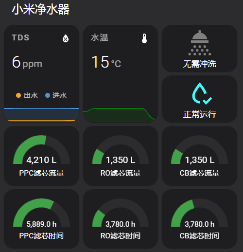

# xiaomi_miio_waterpurifier_yunmi

小米净水器C1的Home Assistant custom component（基于`python-miio`）

[English](README.md)

## 支持机型

* [yunmi.waterpuri.lx9（扁豆）](https://home.miot-spec.com/spec/yunmi.waterpuri.lx9)
* [yunmi.waterpuri.lx11（C1 三出水）](https://home.miot-spec.com/spec/yunmi.waterpuri.lx11)

## 提供的实体

* 错误原因：Error reason 
* PPC滤芯剩余时间：Filter#1 (PPC) remaining time (h)
* PPC滤芯已用时间：Filter#1 (PPC) used time (h)
* PPC滤芯剩余流量Filter#1 (PPC) remaining flow (L)
* PPC滤芯已用流量：Filter#1 (PPC) used flow (L)
* RO滤芯剩余时间：Filter#2 (RO) remaining time (h)
* RO滤芯已用时间：Filter#2 (RO) used time (h)
* RO滤芯剩余流量：Filter#2 (RO) remaining flow (L)
* RO滤芯已用流量：Filter#2 (RO) used flow (L)
* CB滤芯剩余时间：Filter#3 (CB) remaining time (h)
* CB滤芯已用时间：Filter#3 (CB) used time (h)
* CB滤芯剩余流量：Filter#3 (CB) remaining flow (L)
* CB滤芯已用流量：Filter#3 (CB) used flow (L)
* 进水TDS：In water TDS (ppm)
* 出水TDS：Out water TDS (ppm)
* 清洗中：Rinsing
* 水温：Water temperature (°C)

P.S. 时间以24h递增，流量以10L递增

## configuration.yaml配置示例

```yaml
sensor:
    - platform: xiaomi_miio_waterpurifier_yunmi
      name: 'Xiaomi Water Purifier C1'
      host: <host_ip>
      token: <host_token>
```

## Lovelace配置示例

* 需独立安装的前端模块: `mini-graph-card`, `button-card`



```yaml
type: vertical-stack
title: 小米净水器
cards:
  - type: horizontal-stack
    cards:
      - type: custom:mini-graph-card
        name: TDS
        entities:
          - entity: sensor.xiaomi_water_purifier_c1_out_water_tds
            name: 出水
          - entity: sensor.xiaomi_water_purifier_c1_in_water_tds
            name: 进水
        hours_to_show: 3
        points_per_hour: 6
      - type: custom:mini-graph-card
        name: 水温
        entities:
          - entity: sensor.xiaomi_water_purifier_c1_water_temperature
            color: green
        hours_to_show: 3
        points_per_hour: 6
      - type: vertical-stack
        cards:
          - type: custom:button-card
            entity: sensor.xiaomi_water_purifier_c1_rinsing
            show_label: true
            show_name: false
            state:
              - value: 0
                color: gray
                label: 无需冲洗
              - value: 1
                color: orange
                label: 冲洗中
          - type: custom:button-card
            entity: sensor.xiaomi_water_purifier_c1_error_reason
            show_label: true
            show_name: false
            state:
              - value: None
                operator: '=='
                color: cyan
                label: 正常运行
                icon: mdi:water-check-outline
              - value: None
                operator: '!='
                color: red
                label: '[[[ return entity.state; ]]]'
  - type: vertical-stack
    cards:
      - type: horizontal-stack
        cards:
          - type: gauge
            min: 0
            max: 7200
            entity: sensor.xiaomi_water_purifier_c1_filter_1_ppc_used_flow
            severity:
              green: 0
              yellow: 5600
              red: 7200
            name: PPC滤芯流量
          - type: gauge
            min: 0
            max: 7200
            entity: sensor.xiaomi_water_purifier_c1_filter_2_ro_used_flow
            name: RO滤芯流量
            severity:
              green: 0
              yellow: 5600
              red: 7200
          - type: gauge
            min: 0
            max: 7200
            entity: sensor.xiaomi_water_purifier_c1_filter_3_cb_used_flow
            name: CB滤芯流量
            severity:
              green: 0
              yellow: 5600
              red: 7200
      - type: horizontal-stack
        cards:
          - type: gauge
            min: 0
            max: 8640
            entity: sensor.xiaomi_water_purifier_c1_filter_1_ppc_used_time
            severity:
              green: 0
              yellow: 7000
              red: 8640
            name: PPC滤芯时间
          - type: gauge
            min: 0
            max: 17280
            entity: sensor.xiaomi_water_purifier_c1_filter_2_ro_used_time
            name: RO滤芯时间
            severity:
              green: 0
              yellow: 14000
              red: 17280
          - type: gauge
            min: 0
            max: 8640
            entity: sensor.xiaomi_water_purifier_c1_filter_3_cb_used_time
            name: CB滤芯时间
            severity:
              green: 0
              yellow: 7000
              red: 8640

```